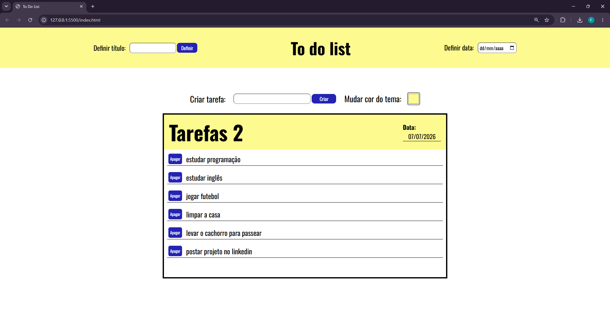
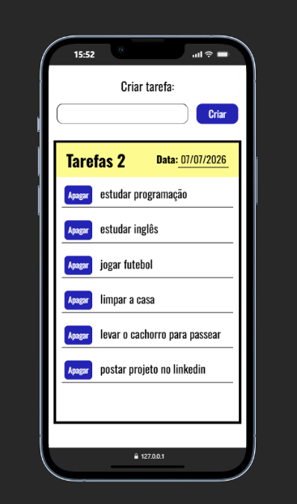

# 📝 To Do List

Aplicação de lista de tarefas desenvolvida com HTML, CSS e JavaScript puro, criada durante o curso de **JavaScript** do [Otávio Miranda](https://www.udemy.com/user/otavio-miranda/) na Udemy.

## 🖥️ Demonstração

### Desktop


### Mobile


## 🚀 Funcionalidades

- ✅ Criar e apagar tarefas
- ✅ Definir título personalizado
- ✅ Definir data
- ✅ Mudar cor do tema
- ✅ Dados salvos no **localStorage** (persistem ao recarregar a página)
- ✅ Layout responsivo (desktop e mobile)

## 🛠️ Tecnologias

- HTML5
- CSS3 (Flexbox + Media Queries)
- JavaScript (DOM, Events, LocalStorage)
- [Google Fonts — Oswald](https://fonts.google.com/specimen/Oswald)

## 📚 Aprendizados

Projeto desenvolvido para praticar conceitos aprendidos no curso, como:

- Manipulação do **DOM** (`querySelector`, `createElement`, `appendChild`)
- **Eventos** (`addEventListener`, `click`, `keypress`, `change`)
- **LocalStorage** (`setItem`, `getItem`, `JSON.stringify`, `JSON.parse`)
- **Delegação de eventos** (event delegation para botões criados dinamicamente)
- **CSS responsivo** com media queries

## 📁 Estrutura do projeto

```
todolist/
├── index.html
├── css/
│   └── style.css
└── js/
    └── main.js
```

## 💻 Como usar

1. Clone o repositório:
   ```bash
   git clone https://github.com/fabiothieres/todolist.git
   ```

2. Abra o `index.html` no navegador.
